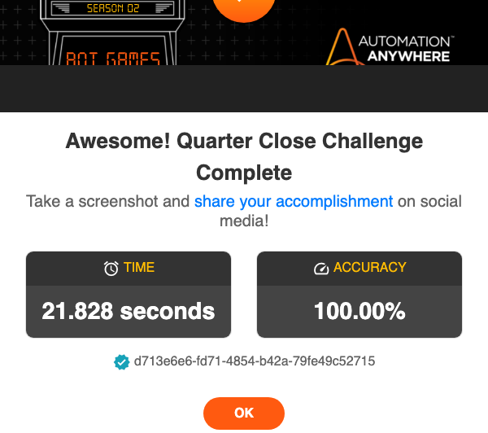

# Quarter Close Challenge


This robot solves the [Quarter Close Challenge](https://developer.automationanywhere.com/challenges/automationanywherelabs-quarterclose.html).

> Create a bot that can review all the transactions displayed on the challenge page and for each of these transactions, find the matching transaction in the banking application. If a match is found, mark the transaction as ‘Verified’. If no match is found, mark the transaction as ‘Unverified’ so that the finance team can dig into this transaction further. Update the status for all the transactions on the page and Submit to complete the challenge.

## The robot code

> Note: There is no one and only "correct" solution. This is just one example of how you _might_ use Robocorp to solve this challenge.

The robot uses the [RPA.Browser.Playwright](https://robocorp.com/docs/libraries/rpa-framework/rpa-browser-playwright) library for browser automation. The [RPA.Robocorp.Vault](https://robocorp.com/docs/libraries/rpa-framework/rpa-robocorp-vault) library handles the required login credentials (these can be managed either locally or in Control Room). The built-in [Collections](https://robocorp.com/docs/libraries/built-in/collections) library provides keywords for handling lists and dictionaries.

```robot
*** Settings ***
Documentation       Completes the Quarter Close challenge.

Library             Collections
Library             RPA.Browser.Playwright
Library             RPA.Robocorp.Vault


*** Tasks ***
Complete the Quarter Close challenge
    ${transaction_page}=    Open the transaction review website
    Accept cookies
    ${transactions}=    Get transactions
    Open the bank web application
    Log in to the bank web application
    ${matched_transactions}=    Match transactions    ${transactions}
    Switch Page    ${transaction_page}[page_id]
    Save transaction statuses    ${matched_transactions}
    Take a screenshot of the result


*** Keywords ***
Open the transaction review website
    New Context    userAgent=Chrome/100.0.4896.75
    ${transaction_page}=
    ...    New Page
    ...    https://developer.automationanywhere.com/challenges/automationanywherelabs-quarterclose.html
    RETURN    ${transaction_page}

Accept cookies
    Click    id=onetrust-accept-btn-handler

Open the bank web application
    Click    css=a.btn-peters
    Switch Page    NEW

Log in to the bank web application
    ${secret}=    Get Secret    arcadiaBank
    Fill Secret    id=inputEmail    ${secret}[username]
    Fill Secret    id=inputPassword    ${secret}[password]
    Click    css=a >> text="Login"

Get transactions
    ${transaction_elements}=    Get Elements    css=div[id^="transaction"]
    ${transactions}=    Create List
    FOR    ${transaction_element}    IN    @{transaction_elements}
        ${id}=
        ...    Get Property
        ...    ${transaction_element}
        ...    id
        ${account}=
        ...    Get Property
        ...    ${transaction_element} >> input[id^="PaymentAccount"]
        ...    value
        ${amount}=
        ...    Get Property
        ...    ${transaction_element} >> input[id^="PaymentAmount"]
        ...    value
        ${transaction}=
        ...    Create Dictionary
        ...    id=${id}
        ...    account=${account}
        ...    amount=${amount}
        Append To List    ${transactions}    ${transaction}
    END
    RETURN    ${transactions}

Match transactions
    [Arguments]    ${transactions}
    FOR    ${transaction}    IN    @{transactions}
        Open the account page    ${transaction}
        ${status}=    Search transaction and return status    ${transaction}
        Set To Dictionary    ${transaction}    status=${status}
    END
    RETURN    ${transactions}

Open the account page
    [Arguments]    ${transaction}
    Click    css=a >> text="${transaction}[account]"

Search transaction and return status
    [Arguments]    ${transaction}
    Wait For Elements State    id=transactions
    Type Text
    ...    css=.dataTable-search input.dataTable-input
    ...    ${transaction}[amount]
    ${transaction_found}=
    ...    Run Keyword And Return Status
    ...    Wait For Elements State
    ...    text="Showing 1 to 1 of 1 entries"
    ...    timeout=1.5 seconds
    ${status}=    Set Variable    Unverified
    IF    ${transaction_found}
        ${status}=    Set Variable    Verified
    END
    RETURN    ${status}

Save transaction statuses
    [Arguments]    ${transactions}
    FOR    ${transaction}    IN    @{transactions}
        Select Options By
        ...    css=#${transaction}[id] select[id^="Status"]
        ...    value
        ...    ${transaction}[status]
    END
    Click    id=submitbutton    force=True

Take a screenshot of the result
    Sleep    1 second
    Take Screenshot    selector=css=#myModal .modal-content
```

### Open the transaction review website

The robot opens a new headless browser. Since this robot interacts with multiple web pages, the page details are returned so that the robot can switch between the pages when needed.

### Accept cookies

The cookies are accepted by clicking a button.

### Get transactions

The robot scrapes all the transactions from the web page and returns the relevant transaction data as a list of dictionaries. CSS provides useful queries for selecting elements where the given attribute starts with the given value, for example: `div[id^="transaction"` (select all the `div` elements where the `id` value starts with `transaction`).

### Open the bank web application

The robot opens the bank application by clicking the opening link on the transaction review website. The bank application opens into a new tab. The [Switch Page](https://robocorp.com/docs/libraries/rpa-framework/rpa-browser-playwright/keywords#switch-page) keyword switches to the new tab.

### Log in to the bank web application

The robot fetches the credentials from a [vault](https://robocorp.com/docs/development-guide/variables-and-secrets/vault) and logs in.

### Match transactions

The robot searches for the transactions and sets the status based on whether the transaction was found or not.

### Save transaction statuses

Switching back to the transaction review page, the robot sets the statuses and submits the page.

### Take a screenshot of the result

Finally, the robot takes a screenshot of the result modal.


